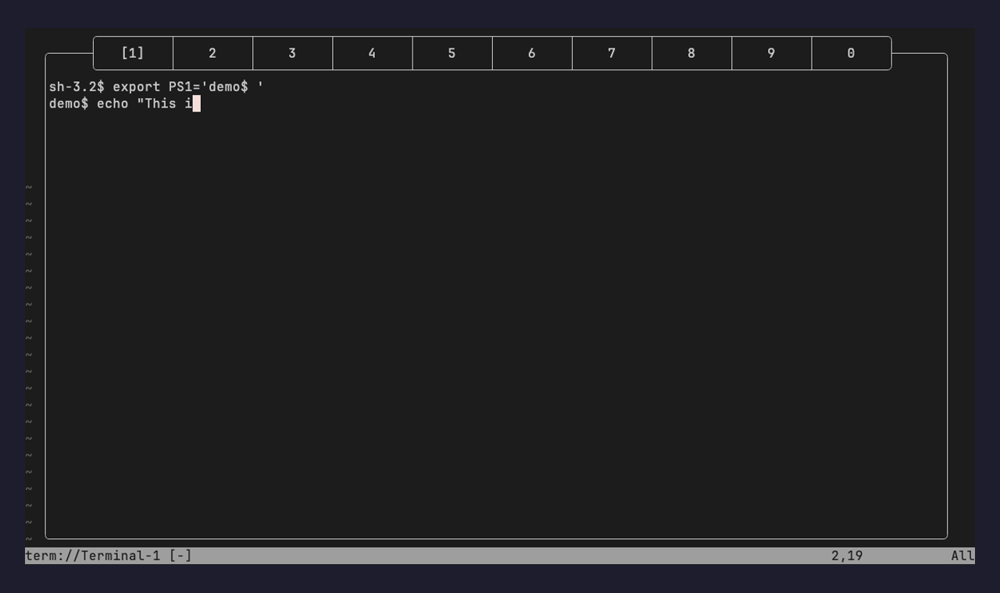

# terminals.nvim

<p align="center">
  
</p>


A terminal manager for Neovim with up to 10 persistent terminal slots, a tab-style header, and keyboard-driven navigation.

## Requirements

- Neovim >= 0.8.0
- macOS (default keymaps use the `<D-…>` Cmd modifier)

## Installation

### lazy.nvim

```lua
{
  "sassanh/terminals.nvim",
  config = function()
    require("terminals").setup()
  end,
}
```

### packer.nvim

```lua
use({
  "sassanh/terminals.nvim",
  config = function()
    require("terminals").setup()
  end,
})
```

### LuaRocks

```sh
luarocks install terminals.nvim
```

## Setup

Call `setup()` to register keymaps and autocmds:

```lua
require("terminals").setup()
```

## Default Keymaps

| Keymap | Action |
| --- | --- |
| `<D-0>` … `<D-9>` | Open or switch to terminal slot 0–9 |
| `<D-BS>` | Toggle the terminal window |
| `<D-m>` | Cycle through configured window layouts |
| `<D-h>` / `<D-l>` | Move left/right between terminals |
| `<D-S-h>` / `<D-S-l>` | Move the terminal buffer left/right |
| `<D-i>` | Enter terminal input mode (all keys go to the shell) |
| `<D-S-i>` | Leave terminal input mode |
| `<D-[>` | Leave terminal mode |
| `<D-/>` / `<D-?>` | Backward search in the terminal buffer |
| `<D-p>` / `<D-S-p>` | Paste with `p` or `P` in the terminal buffer |

## Configuration

### Keymaps

All keymaps are configurable:

```lua
require("terminals").setup({
  keys = {
    go_left = "<D-h>",
    go_right = "<D-l>",
    move_left = "<D-S-h>",
    move_right = "<D-S-l>",
    toggle = "<D-BS>",
    cycle_layout = "<D-m>",
    toggle_reverse_search = "<D-/>",
    focus = "<D-i>",
    unfocus = "<D-S-i>",
    leave = "<D-[>",
    paste = "<D-p>",
    paste_in_place = "<D-S-p>",
    modifier = "D",
  },
  preserved_keys = {},
})
```

`modifier` is used to build the `<D-0>` … `<D-9>` slot keymaps. Set it to match your platform's super/meta modifier (for example `"D"` on macOS).

`preserved_keys` lets you keep specific terminal-mode keymaps when leaving input mode.

### Window size and position

`width`, `height`, `row`, and `col` control the terminal window layout. Each accepts a fixed number or a percentage string such as `"80%"`.

```lua
require("terminals").setup({
  width = "70%",
  height = 40,
  row = 0,
  col = "center",
})
```

| Option | Default | Description |
| --- | --- | --- |
| `width` | Scales with editor width | Window width in columns |
| `height` | `vim.o.lines - 1` | Window height in lines |
| `row` | `0` | Distance from the top of the editor |
| `col` | Horizontally centered | Distance from the left of the editor |

For `row` and `col`, you can also use alignment keywords:

- `"center"` — center along that axis
- `"bottom"` — align to the bottom (`row` only)
- `"right"` — align to the right (`col` only)

Computed dimensions are clamped to stay on screen. Width is never less than 26 columns. Height is never less than 4 lines, which is the minimum needed to render the border and tab bar. If the configured width is too narrow for the full tab bar, tab padding is reduced before the existing tab-bar scroll/truncation kicks in.

### Layout presets

`layouts` is a list of size/position presets. Press `cycle_layout` (default `<D-m>`) to ring through them while the terminal is open. The index also advances when the terminal is closed, so the next open uses the newly selected preset.

```lua
require("terminals").setup({
  keys = {
    cycle_layout = "<D-m>",
  },
  layouts = {
    { width = "100%", height = "100%", row = 0, col = 0 },
    { width = "40%", height = "50%", row = 0, col = "right" },
  },
})
```

The default presets are fullscreen (`100%` × `100%`) and a minimized top-right corner (`40%` × `50%`). Each preset accepts the same `width`, `height`, `row`, and `col` fields; unset fields inherit from the top-level window options.

## Commands

- `:Terminal [cmd]` — open a terminal, optionally running `cmd`
- `:ToggleTerminal` — toggle the terminal window
- `:CloseTerminal` — close the terminal window

## API

```lua
require("terminals").activate_terminal({ id = 1 })
```

Options:

- `id` — terminal slot (0–9)
- `toggle` — toggle if already on the same slot (default: `true`)
- `append_mode` — start in insert mode (default: `true`)
- `args` — shell command to run when creating a new terminal

New terminals use your default shell unless `args` is passed or `shell` is set in `setup()`.

```lua
require("terminals").setup({
  shell = "/bin/bash",
})
```
